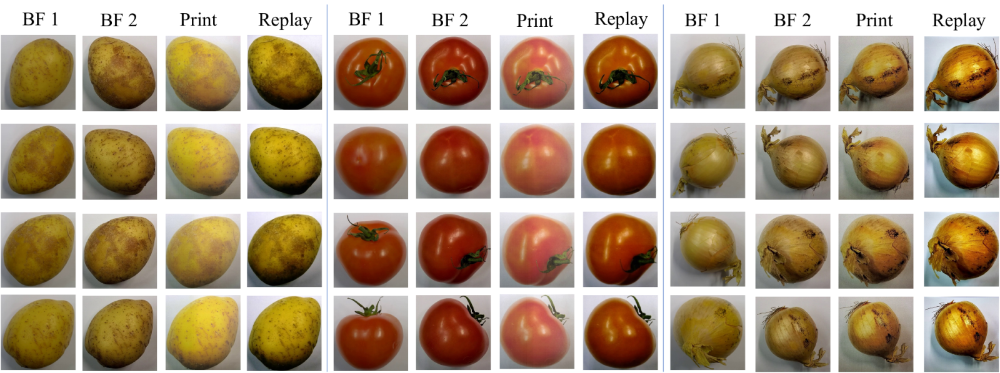

# TPO: Tomatoes, Potatoes, and Onions

Official repository for **"Tomatoes, Potatoes, and Onions: Questioning the Need for Faces in Face Presentation Attack Detection"**, accepted at the 6th International Workshop on Human-centric Multimedia Analysis (**HUMA '26**), ACM Multimedia 2026.

Face presentation attack detection (PAD) is traditionally treated as a face-specific problem. This work asks whether that is necessary. We introduce **TPO**, a controlled, face-free PAD dataset of bona fide, print, and replay recordings of tomatoes, potatoes, and onions, acquired under a protocol that mirrors conventional face PAD datasets. A FoundPAD detector trained *only* on TPO, having never seen a face during PAD training, reaches **92.70% average AUC** across the four standard cross-dataset face PAD benchmarks (MSU-MFSD, CASIA-FASD, Idiap Replay-Attack, OULU-NPU), outperforming training on synthetic faces and remaining competitive with training on real face datasets.

This repository releases the **TPO dataset**, its **protocols**, the **pre-trained TPO detector**, and minimal scripts to **train** and **run inference**.



*Bona fide, print, and replay presentations of the same potato, tomato, and onion identities. Every object appears as two bona fide captures (BF 1, BF 2) and as print and replay attacks recaptured by a second camera. Face PAD datasets have exactly this structure; TPO keeps the acquisition and presentation-instrument cues and removes the face.*

---

## The TPO dataset

TPO contains 12,480 presentations of 78 vegetable identities (26 physically distinct specimens each of tomatoes, potatoes, and onions). Bona fide objects were captured indoors from four viewpoints at two scales with two devices (Microsoft Surface tablet, Samsung Galaxy smartphone). Print attacks were printed on A4 and recaptured; replay attacks were displayed on either device and recorded with either device. Source/capture device, source/capture scale, identity, and viewpoint are exhaustively crossed, so matched and mismatched recapture conditions are both covered.

| Subset | Videos | Images | Total |
|---|---:|---:|---:|
| Bona fide | 1,248 | 1,248 | 2,496 |
| Print attacks | 4,992 | – | 4,992 |
| Replay attacks | 4,992 | – | 4,992 |
| **Total** | **11,232** | **1,248** | **12,480** |

The release ships **extracted frames**, which is what the code consumes: five frames sampled uniformly over the middle 80% of each video (avoiding black margins left by replay segmentation) and one frame per still image, stored as 256×256 PNGs. This yields **57,408 frames**. No face detector or landmark step is involved anywhere in the pipeline.

---

## Getting the dataset

The TPO dataset is distributed on request for research purposes. Fill in the form below with your **name, affiliation, and email**; you will receive a download link to `TPO.zip`.

> **[→ Request access to TPO](ADD_YOUR_GOOGLE_DRIVE_REQUEST_FORM_LINK_HERE)**

Unpack the archive into `data/`, so that the frames land in `data/TPO/`:

```bash
unzip TPO.zip -d data/
```

The layout is expected to be:

```
data/
├── protocols/          # shipped with this repository
│   ├── tpo_all.csv
│   ├── tpo_tomatoes.csv, tpo_potatoes.csv, tpo_onions.csv
│   ├── tpo_print.csv, tpo_replay.csv
│   └── tpo_index.csv
└── TPO/                # from the archive
    ├── tomatoes/
    ├── potatoes/
    └── onions/
```

Verify the unpacked dataset at any time:

```bash
python src/check_data.py
```

The raw, un-extracted video recordings (~194 GB) are not part of the standard release; contact the authors if you need them.

---

## Setup

```bash
conda create -n tpo python=3.10
conda activate tpo
pip install -r requirements.txt
```

The CLIP ViT-B/16 backbone (~350 MB) is downloaded automatically on first use into `~/.cache/clip`, or into `$CLIP_CACHE_DIR` if that variable is set. A single GPU with ≥8 GB is sufficient for both training and inference.

---

## Pre-trained model

`pretrained/foundpad_tpo.pth` is the FoundPAD detector from the paper, trained on the full TPO training source. It is the exact checkpoint behind the 92.70% AUC row of Table 1.

The file contains only the **trainable** weights, the LoRA matrices and the classification head (0.30M parameters, 1.2 MB). The frozen CLIP ViT-B/16 backbone is not duplicated in it and is fetched from OpenAI's CLIP release at load time.

---

## Inference

The network score is **P(bona fide)** in `[0, 1]`: high means bona fide, low means attack.

On a labelled protocol CSV, which reports frame- and video-level AUC, EER, and HTER:

```bash
python src/infer.py --ckpt pretrained/foundpad_tpo.pth \
                    --csv data/protocols/tpo_all.csv
```

On your own images, which reports per-image scores:

```bash
python src/infer.py --ckpt pretrained/foundpad_tpo.pth \
                    --images path/to/frames/ \
                    --scores_out scores.csv
```

### Evaluating on your own dataset

Point `--csv` at any CSV with a header row whose first two columns are `image_path` and `label` (`bonafide` or `attack`); further columns are ignored. Paths may be absolute, or relative to the repository root.

```csv
image_path,label
/data/my_pad_set/subject01/attack_print_0.png,attack
/data/my_pad_set/subject01/real_0.png,bonafide
```

Frame scores are averaged per presentation before video-level metrics are computed. Frames of one presentation are grouped by stripping the trailing `_<k>` from the file name, so `.../video12_0.png … .../video12_4.png` form one video, and a still image is treated as a one-frame presentation. HTER is reported at the evaluated set's own EER threshold, following the common cross-dataset PAD convention.

---

## Training

Reproduce the released checkpoint:

```bash
python src/train.py --train_csv data/protocols/tpo_all.csv --out runs/tpo
```

Defaults are the settings the released model was trained with: CLIP ViT-B/16 frozen, rank-stabilised LoRA on the query and value projections of all 12 attention blocks (`r=8`, `alpha=8`, dropout `0.4`), a linear two-class head on the L2-normalised embedding, AdamW without a schedule (`betas=(0.9, 0.999)`, weight decay `5e-5`), gradient clipping at norm 5, batch size 48, LoRA lr `5e-6`, head lr `1e-4`, inverse-class-frequency sampling, 9 epochs, seed 777. Training augmentation is horizontal flip, additive Gaussian noise, brightness shift, per-channel RGB shift, and gamma jitter, each applied independently with probability 0.5; evaluation uses resizing and normalisation only. Frames are normalised with CLIP's own channel statistics rather than ImageNet's, which corrects a preprocessing mismatch in FoundPAD's public pipeline.

TPO is used in its **entirety** as a training source: no train, development, or test partition is carved out of it, so there is no checkpoint selection and the final epoch is the released model. Cross-dataset targets can be scored directly after training:

```bash
python src/train.py --train_csv data/protocols/tpo_all.csv --out runs/tpo \
                    --test_csv /path/to/msu.csv /path/to/casia.csv \
                    --test_name msu casia
```

Training the full 9 epochs takes about 2 hours on a single RTX 4060 Ti (16 GB), using around 6 GB of GPU memory.

The seed is fixed at 777, but multi-worker data loading and cuDNN autotuning make training runs non-deterministic at the bit level, so a retrained model will land close to, rather than exactly on, the published numbers. `pretrained/foundpad_tpo.pth` is the exact model the paper reports.

### Ablations

The shipped protocols and the `--fraction` flag reproduce the paper's ablation study:

```bash
python src/train.py --train_csv data/protocols/tpo_print.csv --out runs/print_only
python src/train.py --train_csv data/protocols/tpo_onions.csv --out runs/onions_only
python src/train.py --train_csv data/protocols/tpo_all.csv --fraction 0.1 --out runs/frac10
```

---

## Results

FoundPAD trained on TPO, evaluated cross-dataset on the four standard face PAD benchmarks. No face is seen during PAD training.

| Training data | → M | → C | → I | → O | Avg. HTER ↓ | Avg. AUC ↑ |
|---|---|---|---|---|---|---|
| CLIP ViT-B/16 zero-shot | 46.67 / 53.52 | 52.78 / 44.44 | 37.45 / 66.58 | 42.12 / 59.89 | 44.75 | 56.11 |
| TPO, ViT-B/16 ImageNet-21k | 41.90 / 59.98 | 48.56 / 55.76 | 21.35 / 85.29 | 36.07 / 70.22 | 36.97 | 67.81 |
| SynthASpoof, FoundPAD | 42.86 / 67.76 | 28.78 / 79.00 | 15.00 / 92.64 | 23.62 / 84.70 | 27.56 | 81.02 |
| **TPO, FoundPAD** | **15.00 / 91.01** | **11.11 / 95.98** | **12.20 / 94.08** | **18.30 / 89.74** | **14.15** | **92.70** |

Cells are HTER / AUC in percent. M = MSU-MFSD, C = CASIA-FASD, I = Idiap Replay-Attack, O = OULU-NPU.

Which properties of TPO drive the transfer (all rows are FoundPAD trained on a TPO subset):

| TPO training subset | Protocol | Avg. HTER ↓ | Avg. AUC ↑ |
|---|---|---:|---:|
| all vegetables, both attacks | `tpo_all.csv` | **14.15** | **92.70** |
| print attacks only | `tpo_print.csv` | 22.00 | 86.14 |
| replay attacks only | `tpo_replay.csv` | 24.70 | 83.97 |
| tomatoes only | `tpo_tomatoes.csv` | 23.76 | 83.14 |
| potatoes only | `tpo_potatoes.csv` | 25.74 | 82.90 |
| onions only | `tpo_onions.csv` | 16.05 | 91.78 |
| 50% of frames | `tpo_all.csv --fraction 0.5` | 14.99 | 91.97 |
| 25% of frames | `tpo_all.csv --fraction 0.25` | 14.35 | 92.71 |
| 10% of frames | `tpo_all.csv --fraction 0.1` | 13.56 | 92.97 |

Attack-instrument diversity matters more than the number of frames: restricting TPO to a single attack type costs 6–9 AUC points, while training on only 10% of the frames costs nothing.

---

## Repository contents

```
src/
├── train.py        # train FoundPAD on TPO
├── infer.py        # score a protocol CSV or a folder of images
├── check_data.py   # verify the unpacked dataset against the protocols
├── models.py       # CLIP ViT-B/16 + rsLoRA + linear head
├── dataset.py      # protocol CSV loading and the paper's pre-processing
├── evaluate.py     # scoring helpers
├── metrics.py      # AUC, EER, HTER, video-level aggregation
└── lora.py         # LoRA layers, vendored from FoundPAD
data/protocols/     # TPO protocol CSVs
pretrained/         # TPO-trained FoundPAD checkpoint
assets/             # figures used in this README
```

---

## Citation

```bibtex
@inproceedings{ozgur2026tpo,
  author    = {Ozgur, Guray and Boutros, Fadi and Damer, Naser},
  title     = {Tomatoes, Potatoes, and Onions: Questioning the Need for Faces
               in Face Presentation Attack Detection},
  booktitle = {Proceedings of the 6th International Workshop on Human-centric
               Multimedia Analysis (HUMA '26)},
  year      = {2026},
  doi       = {10.1145/3841192.3841760}
}
```

The detector follows FoundPAD, which should be cited alongside this work:

```bibtex
@inproceedings{DBLP:conf/wacv/OzgurCCBRD25,
  author    = {Ozgur, Guray and Caldeira, Eduarda and Chettaoui, Tahar and
               Boutros, Fadi and Ramachandra, Raghavendra and Damer, Naser},
  title     = {FoundPAD: Foundation Models Reloaded for Face Presentation
               Attack Detection},
  booktitle = {IEEE/CVF Winter Conference on Applications of Computer Vision
               Workshops (WACVW)},
  year      = {2025}
}
```

---

## Ethics and privacy

TPO contains no human subjects, no biometric data, and no personally identifiable information. It implements print and replay attacks that are already standard in public PAD research, so we consider the additional misuse potential minimal. The face datasets used for comparison in the paper are not redistributed here and must be obtained from their original owners under the appropriate licences.

## Acknowledgement

This research work has been funded by the German Federal Ministry of Education and Research and the Hessian Ministry of Higher Education, Research, Science and the Arts within their joint support of the National Research Center for Applied Cybersecurity ATHENE.

## License

This project is licensed under the terms of the Attribution-NonCommercial-ShareAlike 4.0 International (CC BY-NC-SA 4.0) license. Copyright © 2026 Fraunhofer Institute for Computer Graphics Research IGD Darmstadt.
